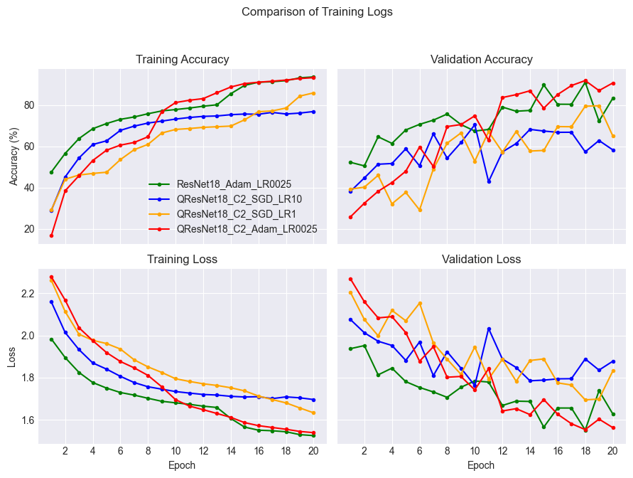
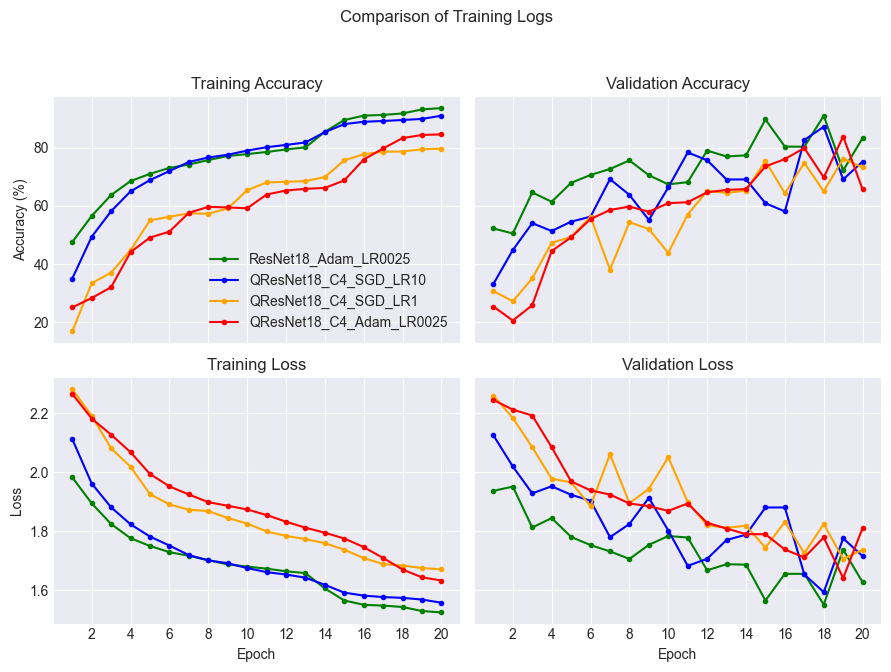
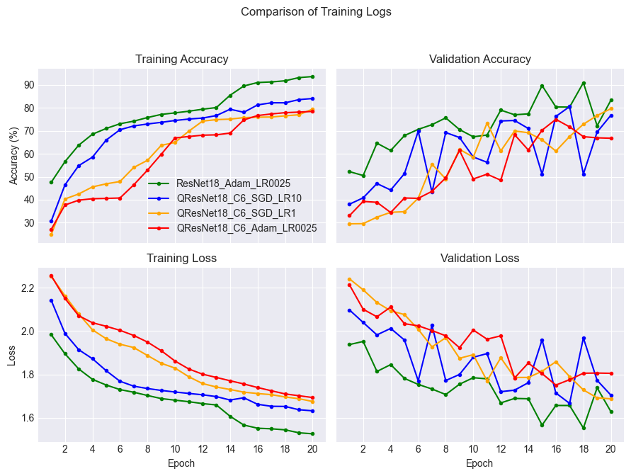
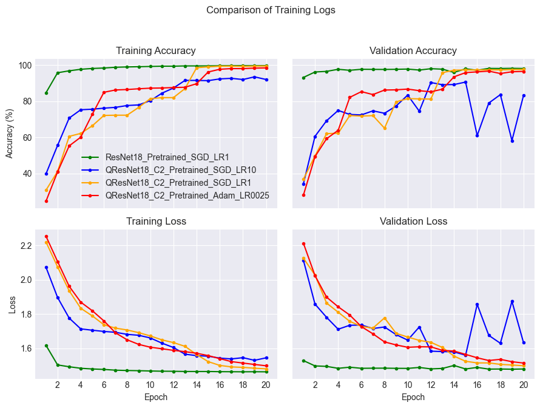
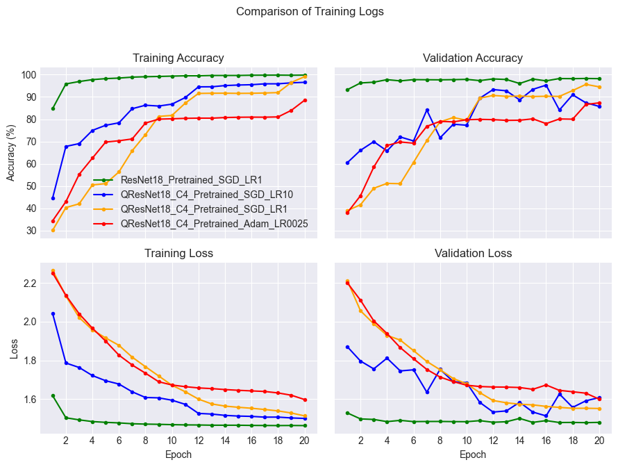
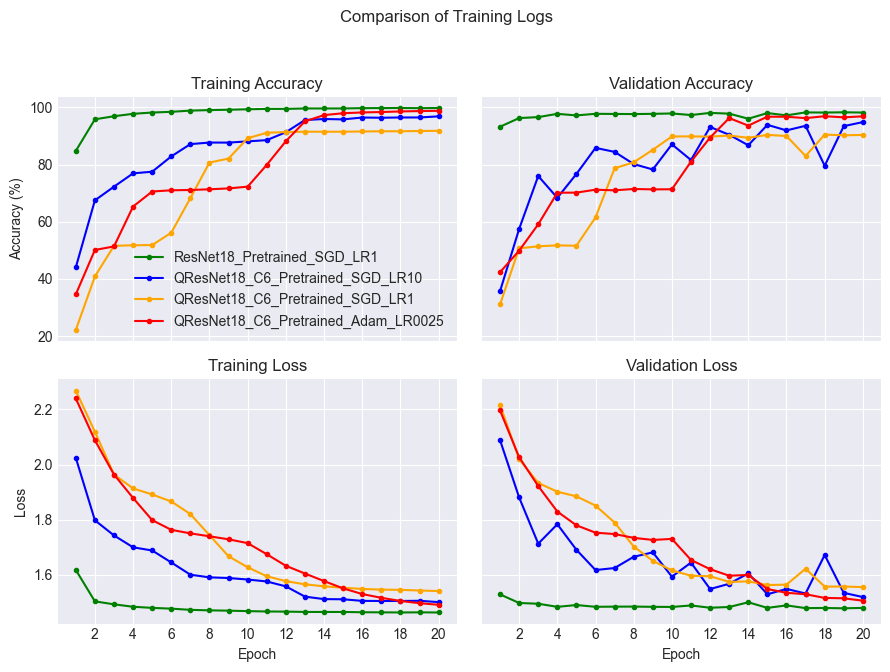
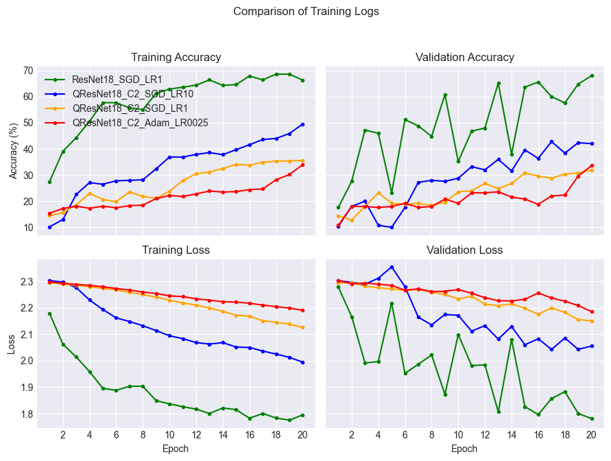
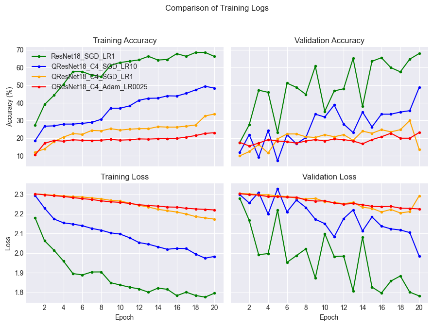
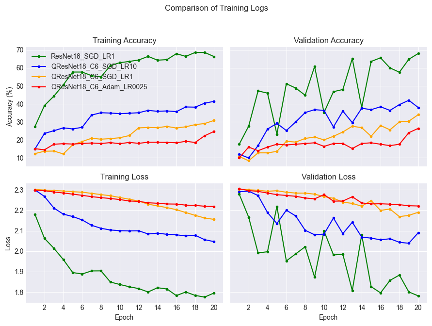

# Hybrid Quantum ResNet

- all experiments are done with a 80/20 split.

## Comparisons for the "best" resnet against all the qresnets (full dataset, no pretrained)

- ResNet vs QResnets w/ two circuit repetitions

- ResNet vs QResnets w/ four circuit repetitions

- ResNet vs QResnets w/ six circuit repetitions

### Pretrained comparisons

- ResNet vs QResnets w/ two circuit repetitions

- ResNet vs QResnets w/ four circuit repetitions

- ResNet vs QResnets w/ six circuit repetitions

## Comparisons for the "best" resnet against all the qresnets (1250 samples dataset, no pretrained)

- ResNet vs QResnets w/ two circuit repetitions

- ResNet vs QResnets w/ four circuit repetitions

- ResNet vs QResnets w/ six circuit repetitions
